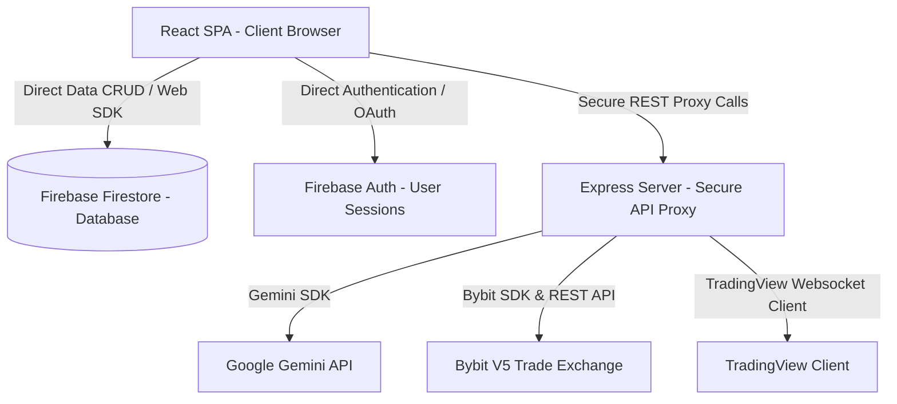

# 🏗️ ARCHITECTURE.md — Razchly Tech Stack & System Architecture

## 1. High-Level Architecture Diagram
The application follows a **Decentralized Client-to-Cloud (BaaS)** pattern, with an Express middleware server acting as a secure gateway proxy for third-party REST APIs.

---

## 2. Technology Stack

### Frontend Client
- **Framework:** React 19, TypeScript
- **Bundler:** Vite 6
- **Styling:** Tailwind CSS 4
- **State Management:** Zustand 5
- **Animation:** Motion (Framer Motion)
- **Visuals:** Recharts & D3.js

### Backend Proxy Server
- **Runtime:** Node.js
- **Framework:** Express.js
- **Runner:** tsx (TypeScript execute in dev)
- **Compiler/Bundler:** Esbuild (compiles to CJS for production)

### Databases & Cloud BaaS
- **Primary Data Store:** Firebase Firestore
- **Authentication:** Firebase Auth
- **Admin Operations:** Firebase Admin SDK

---

## 3. Data Synchronization Strategy
- **Real-Time Subscriptions:** React components subscribe directly to Firestore collections via `onSnapshot` queries. This guarantees instant updates across multiple devices or browser tabs.
- **Optimistic UI Updates:** State mutations are registered immediately in local components or stores, while Firestore synchronization occurs asynchronously in the background.

---

## 4. API Proxy Logic
The Express server (`server.ts`) handles API keys securely, shielding them from the browser:
- **TradingView Quotes:** Connects to TradingView using the `TradingView.Client` WebSocket handler, fetching live data on demand and caching it with high-fidelity local mock fallbacks.
- **Bybit Trading Execute:** Takes API keys/secrets securely via POST requests, calculates HMAC-SHA256 signatures server-side, and executes orders directly via the Bybit endpoint.
- **Gemini AI:** Communicates with the Google Gemini API using `@google/genai` to perform OCR receipt scans and multi-layer technical analyses.
